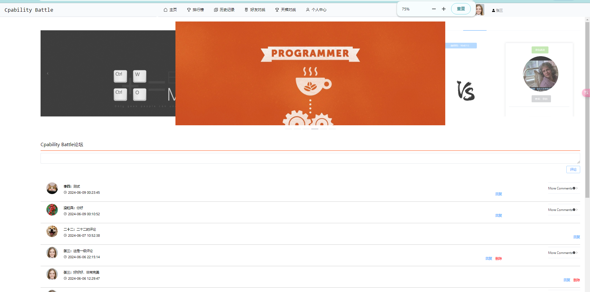
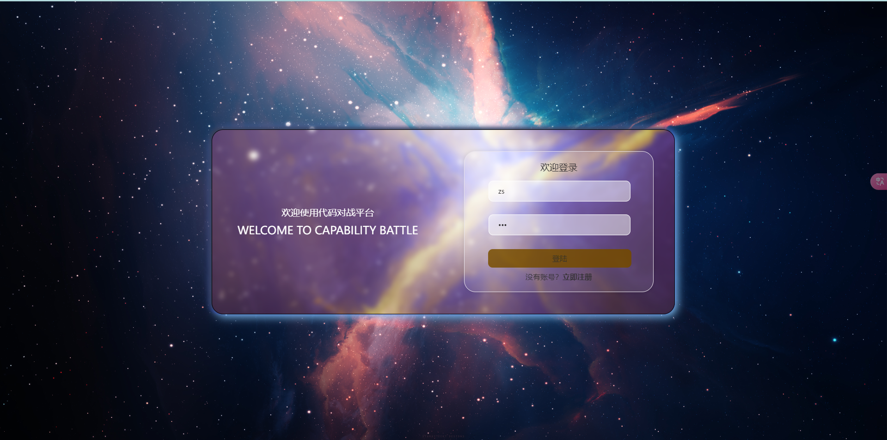
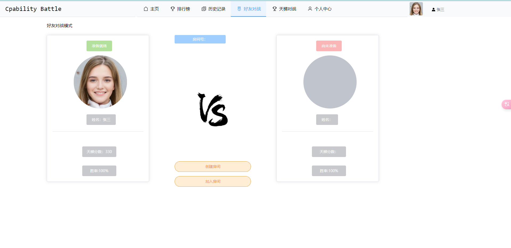
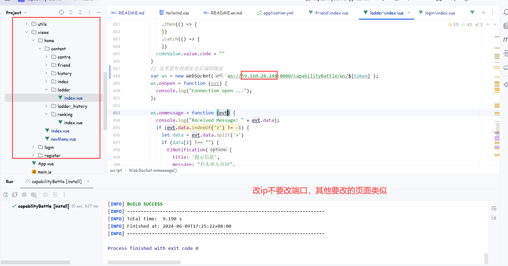
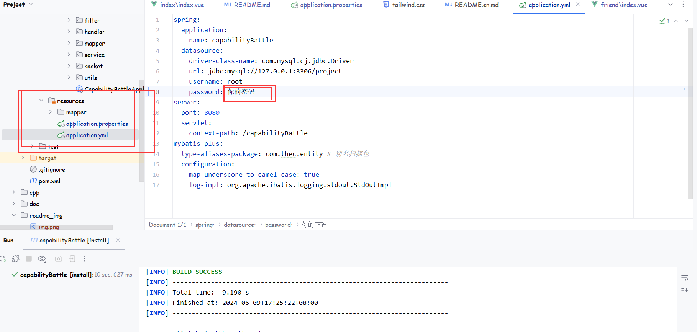

# Capability Battle

#### 介绍
Capability Battle能力对战平台

#### 项目预览
登录注册：

首页：

对战：

其他......
#### 软件架构
软件架构说明
springboot2.7+vue3+redis+springseurity+哈希密码加密+webscoket+mysql8+axios

Css框架：tailwind

接口测试工具：apifox

开发工具：Idea2024、datagrip2023、Php小皮面板。
#### 注意事项
1. 本地需要安装G++的环境和java的环境，因为代码评判功能依赖本地的环境，如果不会参考教程[c++环境配置](https://www.cnblogs.com/wongdzoendzi/p/18236247)

2. 把项目部署到服务器时，注意修改主页的头像地址和webscoket的请求地址，分别在/vuecd/src/views/home/content/下的/index/index.vue和/friend,/ladder目录中，将127.0.0.1改为服务器的ip地址或域名，如下：
   

3. 服务器部署时候，后端运行jar包，前端使用命令`npm run build`将前端打包为dist文件夹，使用nginx反向代理，注意：nginx需要重写配置，操作如下：

  ```shell
  npm run build		//前端打包
  java -jar jar包名称		//单次运行
  nohup Java -jar xxxxxx.jar &  //持久运行，关闭窗口服务器不断
  ```

  ```nginx
  # 总的来说就是将dist的html挂载，然后将前端/api的请求路径反向代理到后端去除api路径的/capabilityBattle路径
  http {
      # 包含 MIME 类型配置
      include mime.types;
  
      server {
          listen 4000;
          server_name 服务器ip或则域名;
  
          location /api {
              rewrite ^/api(.*)$ /capabilityBattle$1 break;
              proxy_pass http://127.0.0.1:8080/capabilityBattle;
              proxy_set_header Host $host;
              proxy_set_header X-Real-IP $remote_addr;
              proxy_set_header X-Forwarded-For $proxy_add_x_forwarded_for;
          }
  
          # 其他静态文件等的配置
          location / {
              root /soft/real/dist; # 你的dist目录路径
              try_files $uri $uri/ /index.html;
          }
      }
  }
  
  # 定义事件块
  events {
      # 使用默认配置
  }
  
  ```

#### 安装教程

1.  mysql8以上
2.  redis3.2.100以上
3.  本地需要g++即c++和java的环境

#### 使用说明

1.  打开项目，maven加载依赖项
2.  配置application.properties和application.yml文件，将redis和mysql密码修改为你的密码
    
3. ```shell
   cd .\vuecb\            // 进入前端路径
   npm install            // 下载前端依赖
   npm run dev            // 部署前端
   idea 运行后端           // 运行后端tomcat
   ```
4. 浏览器中输入127.0.0.1:4000即可访问！
   
#### 参与贡献

1.  [RunPiBoss'blog](https://lxpstar.top/)
2.  [RunPiBoss'github](https://github.com/RunPiBoss)
3.  [MHB'gitee](https://gitee.com/nmu_hbin/capability-battle)
4.  [primary Auth](https://gitee.com/aaaaysy/capability-battle)


#### 新增功能
1. 在主页面添加历史记录下拉菜单，新增天梯历史记录查询
2. 主页面增加小皮论坛，可以自由评论
3. 新增加注册功能，用户可以自己注册，在注册页和登陆页自由切换
4. 修复好友对战功能和天梯对战功能无法连接的问题
5. 首页新增轮播图，点击跳转进行对战
6. 修复代码评判编译错误的bug

